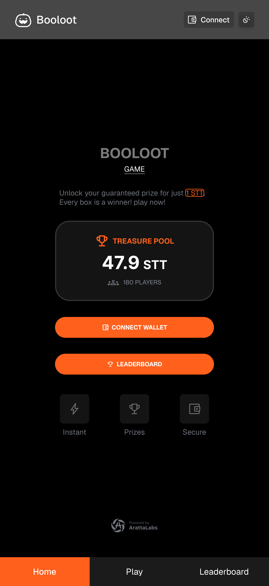

# 💰 Booloot: The Guaranteed-Win Mystery Box Game

## Demo
https://booloot.vercel.app/

## Verified Contract
https://explorer.somnia.network/address/0xD8f7DF0aBD834eDcb3e4FC83A11175eB77449f3B

## UIUX

## Project Overview

Booloot is the guaranteed-win mystery box game! Pay a small fee, open a randomized chest, and instantly win a prize from our fixed pool of rewards. Every player receives a payout, and we use secure Chainlink VRF to ensure every draw is provably fair and tamper-proof. It’s all thrill, no risk—play today to claim your share of the loot!

## 🔒 Security & Fair Play (Chainlink VRF)

This game is built on the principle of verifiable fairness, which is achieved through Chainlink VRF (Verifiable Random Function).

What is VRF? VRF is a decentralized oracle service that provides cryptographically secure, tamper-proof randomness on-chain. This prevents players (or even the contract owner) from predicting or manipulating the outcome of the prize draw.

Asynchronous Drawing: Since the random number generation is secure, the process is asynchronous. When a player pays to play, the contract requests a random number, and the prize is only determined and credited once the VRF service provides the result in a subsequent transaction (the callback).

## ✨ Key Features

Guaranteed Winnings: Every player is guaranteed to win a prize from the fixed prize pool.

Secure Randomness: Utilizes Chainlink VRF for provably fair, non-exploitable prize selection.

Claim Mechanism: Winnings and any overpayments are safely stored in the contract's unclaimedWinnings mapping for players to withdraw at their convenience.

Financial Safety: The contract enforces a minimum balance check to ensure it always holds enough native currency to pay out the largest possible prize (4 ETH) plus the game fee.

Owner Management: The contract owner can pause/unpause the game and update the required fee.

## 🕹️ How to Play (End-User Steps)

Pay the Fee 💰: Send the required ETH to start a round.

Wait for Draw 🔒: A secure, random system selects your prize and credits your balance.

Claim Your Prizes 💸: Withdraw all accumulated funds (prizes and refunds) to your wallet whenever you're ready!

## 🛠️ Technology & Standards

Solidity: v0.8.30

Randomness: Chainlink VRF v2.5 (Direct Funding with native token)

Standards: Uses OpenZeppelin's Ownable, Pausable, and ReentrancyGuard for robust access control and security.

## Challenge we faced
https://docs.chain.link/vrf/v2-5/security#fulfillrandomwords-must-not-revert:~:text=fulfillRandomWords%20must%20not,Automation%20Node.